# Import Verification Report for prompt_driven_agent.py

**Generated:** 2025-11-24T11:33:48+05:30

## ✅ Overall Status: ALL IMPORTS VALID

All imports in `prompt_driven_agent.py` have been verified and are functioning correctly.

---

## Standard Library Imports

All standard library imports are valid:

| Import                               | Status   | Line |
| ------------------------------------ | -------- | ---- |
| `logging`                            | ✅ Valid | 11   |
| `argparse`                           | ✅ Valid | 12   |
| `time`                               | ✅ Valid | 13   |
| `sys`                                | ✅ Valid | 14   |
| `pathlib.Path`                       | ✅ Valid | 15   |
| `typing` (Dict, List, Optional, Any) | ✅ Valid | 16   |

---

## Core Module Imports (Lines 18-23)

All core modules are present and importing correctly:

| Module                      | File Path                        | Status   | Line |
| --------------------------- | -------------------------------- | -------- | ---- |
| `VisionCoordinator`         | `vision_coordinator.py`          | ✅ Valid | 19   |
| `AutomotiveOperatingSystem` | `automotive_operating_system.py` | ✅ Valid | 20   |
| `AutomotiveScreenshot`      | `automotive_screenshot.py`       | ✅ Valid | 21   |
| `TestCaseKnowledgeBase`     | `test_case_knowledge_base.py`    | ✅ Valid | 22   |
| `ExcelReportGenerator`      | `excel_report_generator.py`      | ✅ Valid | 23   |

---

## Optional: Voice Interface (Lines 26-30)

Using try/except pattern for graceful fallback:

| Module           | File Path            | Status   | Import Pattern                       |
| ---------------- | -------------------- | -------- | ------------------------------------ |
| `VoiceInterface` | `voice_interface.py` | ✅ Valid | Try/Except with VOICE_AVAILABLE flag |

**Implementation:**

```python
try:
    from voice_interface import VoiceInterface
    VOICE_AVAILABLE = True
except ImportError:
    VOICE_AVAILABLE = False
```

---

## Optional: RAG & LangChain Imports (Lines 33-40)

Using try/except pattern for backward compatibility:

| Module                     | File Path                  | Status   | Import Pattern                     |
| -------------------------- | -------------------------- | -------- | ---------------------------------- |
| `RAGPromptManager`         | `rag_prompt_manager.py`    | ✅ Valid | Try/Except with RAG_AVAILABLE flag |
| `LangChainCoordinator`     | `langchain_coordinator.py` | ✅ Valid | Try/Except with RAG_AVAILABLE flag |
| `LangGraphWorkflowManager` | `langgraph_workflow.py`    | ✅ Valid | Try/Except with RAG_AVAILABLE flag |

**Implementation:**

```python
try:
    from rag_prompt_manager import RAGPromptManager
    from langchain_coordinator import LangChainCoordinator
    from langgraph_workflow import LangGraphWorkflowManager
    RAG_AVAILABLE = True
except ImportError:
    RAG_AVAILABLE = False
    logging.warning("⚠️ RAG/LangChain not available. Using traditional mode.")
```

---

## Fallback: Traditional Prompt Manager (Lines 43-47)

Used when RAG is not available:

| Module          | File Path           | Status   | Import Pattern                |
| --------------- | ------------------- | -------- | ----------------------------- |
| `PromptManager` | `prompt_manager.py` | ✅ Valid | Conditional import (line 163) |

**Implementation:**

```python
if not RAG_AVAILABLE:
    try:
        from prompt_manager import PromptManager
    except ImportError:
        logging.error("Neither RAG nor traditional prompt manager available!")
```

> [!NOTE]
> The `PromptManager` is also imported dynamically inside the `_init_traditional_mode()` method at line 163.

---

## Import Verification Tests

### Test 1: Core Imports

```bash
python -c "from vision_coordinator import VisionCoordinator; from automotive_operating_system import AutomotiveOperatingSystem; from automotive_screenshot import AutomotiveScreenshot; from test_case_knowledge_base import TestCaseKnowledgeBase; from excel_report_generator import ExcelReportGenerator; print('Core imports: OK')"
```

**Result:** ✅ PASSED

### Test 2: Voice Interface

```bash
python -c "from voice_interface import VoiceInterface; print('Voice interface: OK')"
```

**Result:** ✅ PASSED

### Test 3: RAG/LangChain Imports

```bash
python -c "from rag_prompt_manager import RAGPromptManager; from langchain_coordinator import LangChainCoordinator; from langgraph_workflow import LangGraphWorkflowManager; print('RAG/LangChain imports: OK')"
```

**Result:** ✅ PASSED

### Test 4: Fallback Prompt Manager

```bash
python -c "from prompt_manager import PromptManager; print('Fallback prompt_manager: OK')"
```

**Result:** ✅ PASSED

### Test 5: Complete Module Import

```bash
python -c "import prompt_driven_agent; print('All imports in prompt_driven_agent.py are valid!')"
```

**Result:** ✅ PASSED

---

## File Dependencies

```mermaid
graph TD
    A[prompt_driven_agent.py] --> B[vision_coordinator.py]
    A --> C[automotive_operating_system.py]
    A --> D[automotive_screenshot.py]
    A --> E[test_case_knowledge_base.py]
    A --> F[excel_report_generator.py]
    A -.Optional.-> G[voice_interface.py]
    A -.Optional.-> H[rag_prompt_manager.py]
    A -.Optional.-> I[langchain_coordinator.py]
    A -.Optional.-> J[langgraph_workflow.py]
    A -.Fallback.-> K[prompt_manager.py]

    style A fill:#4CAF50,stroke:#2E7D32,color:#fff
    style B fill:#2196F3,stroke:#1565C0,color:#fff
    style C fill:#2196F3,stroke:#1565C0,color:#fff
    style D fill:#2196F3,stroke:#1565C0,color:#fff
    style E fill:#2196F3,stroke:#1565C0,color:#fff
    style F fill:#2196F3,stroke:#1565C0,color:#fff
    style G fill:#FF9800,stroke:#E65100,color:#fff
    style H fill:#FF9800,stroke:#E65100,color:#fff
    style I fill:#FF9800,stroke:#E65100,color:#fff
    style J fill:#FF9800,stroke:#E65100,color:#fff
    style K fill:#9C27B0,stroke:#6A1B9A,color:#fff
```



**Legend:**

- 🟢 Green: Main file
- 🔵 Blue: Required core imports
- 🟠 Orange: Optional imports (graceful fallback)
- 🟣 Purple: Fallback imports

---

## Import Best Practices Observed

✅ **Excellent practices found in this code:**

1. **Try/Except Pattern for Optional Dependencies**

   - Graceful degradation when optional modules are unavailable
   - Clear flags (`VOICE_AVAILABLE`, `RAG_AVAILABLE`) to check feature availability

2. **Fallback Mechanisms**

   - Falls back to `PromptManager` if RAG components are unavailable
   - Maintains backward compatibility

3. **Clear Import Organization**

   - Standard library imports first (lines 11-16)
   - Core imports grouped together (lines 18-23)
   - Optional imports in separate try/except blocks (lines 26-47)

4. **Informative Logging**

   - Warnings when optional features are unavailable
   - Clear error messages for critical failures

5. **All Imports at Module Level**
   - Except for conditional `PromptManager` import (line 163), which is intentional

---

## Warnings/Notes

> [!NOTE] > **PaddleOCR Dependency**
> The `vision_coordinator.py` module displays a warning about PaddleOCR not being installed. This is a sub-dependency and doesn't affect the import validation, but you may want to install it:
>
> ```bash
> pip install paddleocr
> ```

> [!NOTE] > **Embedding Libraries**
> The `prompt_manager.py` shows a warning about embedding libraries. Install if needed:
>
> ```bash
> pip install langchain langchain-ollama faiss-cpu
> ```

---

## Recommendations

✅ **All imports are valid and properly structured!**

**Optional Improvements:**

1. Consider adding type hints for the imported classes
2. Document which features require which optional imports in the README
3. Add import verification to CI/CD pipeline

---

## Summary

| Category                         | Count  | Status            |
| -------------------------------- | ------ | ----------------- |
| Standard Library Imports         | 6      | ✅ All Valid      |
| Core Module Imports              | 5      | ✅ All Valid      |
| Optional Imports (Voice)         | 1      | ✅ Valid          |
| Optional Imports (RAG/LangChain) | 3      | ✅ All Valid      |
| Fallback Imports                 | 1      | ✅ Valid          |
| **Total**                        | **16** | **✅ 100% Valid** |

**Conclusion:** All imports in `prompt_driven_agent.py` are properly defined, exist in the codebase, and are importing correctly.
