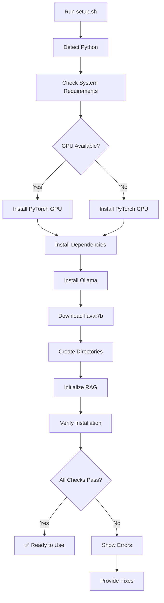

# Setup Automation Walkthrough - AI Agent Framework

## Overview

Created a complete suite of automated setup files for the AI Agent Framework, making installation simple and reliable across all platforms (Linux, macOS, and Windows).

## 📦 What Was Created

### 1. setup.sh - Linux/macOS Setup Script

**Purpose:** Fully automated bash script for Unix-based systems.

**Features:**
- ✅ Automatic Python detection (Python 3.8+)
- ✅ System requirements check (RAM, disk space, GPU)
- ✅ Virtual environment creation
- ✅ Smart PyTorch installation (CPU/GPU auto-detection)
- ✅ All dependencies from requirements.txt
- ✅ Ollama installation and llava:7b download
- ✅ Directory structure creation
- ✅ RAG system initialization
- ✅ ADB verification
- ✅ Comprehensive verification tests
- ✅ Colored terminal output for clarity

**Command-line Options:**
```bash
./setup.sh               # Standard installation
./setup.sh --no-venv     # Skip virtual environment
./setup.sh --gpu         # Force GPU support
./setup.sh --skip-ollama # Skip Ollama
./setup.sh --help        # Show help
```

**Key Functions:**
- `detect_python()` - Finds and validates Python installation
- `check_system_requirements()` - Verifies OS, RAM, disk, GPU
- `create_venv()` - Creates and activates virtual environment
- `install_dependencies()` - Installs PyTorch and all packages
- `install_ollama()` - Installs Ollama and downloads models
- `initialize_rag()` - Sets up vector database
- `run_verification()` - Tests all imports

### 2. setup.bat - Windows Setup Script

**Purpose:** Automated batch script for Windows systems.

**Features:**
- ✅ Python detection
- ✅ Virtual environment creation
- ✅ GPU detection (NVIDIA)
- ✅ Appropriate PyTorch version installation
- ✅ All dependencies installation
- ✅ Directory structure creation
- ✅ Environment configuration
- ✅ Ollama installation guidance
- ✅ RAG initialization
- ✅ ADB verification

**Usage:**
```cmd
setup.bat
```
Simply double-click or run from Command Prompt.

### 3. setup.py - Python Package Setup

**Purpose:** Standard Python package installation using setuptools.

**Features:**
- ✅ Package metadata and version
- ✅ All dependencies listed
- ✅ Entry points for CLI tools
- ✅ Package data inclusion
- ✅ Development dependencies
- ✅ GPU extras

**Created Entry Points:**
- `ai-agent` → Main CLI entry point
- `ai-agent-gui` → GUI interface launcher
- `ai-agent-init` → RAG system initializer

**Installation Methods:**
```bash
# Development mode (recommended for developers)
pip install -e .

# Normal installation
pip install .

# With development tools
pip install -e ".[dev]"
```

### 4. verify_setup.py - Verification Tool

**Purpose:** Comprehensive verification script to validate installation.

**Checks Performed:**

#### Core Checks
- ✅ Python version (3.8+)
- ✅ Core dependencies (PyTorch, Pillow, OpenCV, NumPy, Ollama)
- ✅ OCR engines (EasyOCR, PaddleOCR, Pytesseract)
- ✅ LangChain ecosystem (LangChain, LangGraph)
- ✅ RAG dependencies (Sentence Transformers, ChromaDB)
- ✅ GUI libraries (PyQt6, pyttsx3)

#### System Checks
- ✅ Directory structure validation
- ✅ Prompt files existence
- ✅ Ollama service status
- ✅ llava:7b model availability
- ✅ Vector database initialization
- ✅ ADB installation and devices
- ✅ GPU support detection

**Usage:**
```bash
python3 verify_setup.py
```

**Output Example:**
```
============================================================================
AI AGENT FRAMEWORK - SETUP VERIFICATION
============================================================================
Enhanced with RAG, LangChain & LangGraph

Checking Core Dependencies
✅ PyTorch
✅ Pillow
✅ OpenCV
✅ NumPy
✅ Ollama

...

VERIFICATION SUMMARY
Total checks: 12
Passed: 12
Failed: 0

🎉 All checks passed! Your AI Agent framework is ready to use.
```

### 5. SETUP_README.md - Comprehensive Documentation

**Purpose:** Complete documentation for all setup files.

**Sections:**
- 📋 Available setup files overview
- 🚀 Quick start guides for each platform
- 📦 What gets installed
- ⚙️ Configuration options
- 🔍 Verification checklist
- 🔧 Troubleshooting guide
- 📚 Post-installation steps
- 🎯 Performance optimization tips

## 🎯 Benefits

### For Users
1. **One-Command Installation** - Run a single script, everything is configured
2. **Platform Agnostic** - Works on Linux, macOS, and Windows
3. **Error Prevention** - Checks and validates every step
4. **Clear Feedback** - Colored output shows progress and issues
5. **Recovery Options** - Detailed troubleshooting for common issues

### For Developers
1. **Reproducible Environments** - Consistent setup across machines
2. **Package Distribution** - Can be installed as Python package
3. **Development Mode** - Easy to modify and test
4. **Verification Tools** - Quick validation of setup state

## 📊 Setup Automation Features

### 1. Intelligent Detection
- Auto-detects Python (python3 or python)
- Identifies OS (Linux, macOS, Windows)
- Detects GPU availability (NVIDIA CUDA)
- Checks system resources (RAM, disk space)

### 2. Smart Installation
- Installs correct PyTorch version (CPU/GPU)
- Creates virtual environment (optional)
- Downloads Ollama and llava:7b model
- Initializes RAG system automatically

### 3. Directory Management
```
Created directories:
├── vector_db/              # Vector database storage
├── reference_icons/        # UI element icons
├── knowledge_base/         # Test cases
├── test_reports/           # Generated reports
├── logs/                   # Application logs
├── screenshots/            # Captured images
└── prompts/                # AI prompts
    └── component_specific/
```

### 4. Configuration Files
- `.env` - Environment variables
- `config.py` - Framework settings (already exists)

## 🔍 Verification Process

The verification script checks:

1. **Python Environment** (3.8+)
2. **Core Dependencies** (10+ packages)
3. **AI/ML Stack** (PyTorch, Transformers)
4. **LangChain Ecosystem** (5 packages)
5. **RAG System** (ChromaDB, embeddings)
6. **OCR Engines** (EasyOCR, PaddleOCR)
7. **Ollama Service** (running + model)
8. **Vector Database** (initialized)
9. **File Structure** (8 directories)
10. **Prompt Files** (4+ files)
11. **ADB Tools** (Android connectivity)
12. **GPU Support** (optional)

## 📈 Installation Workflow



## 💡 Usage Examples

### Fresh Installation (Linux)
```bash
# 1. Download/clone the framework
cd ai-agent-main

# 2. Run setup
chmod +x setup.sh
./setup.sh

# 3. Verify
python3 verify_setup.py

# 4. Activate environment
source venv/bin/activate

# 5. Start using
python3 gui_controller_voice.py
```

### Fresh Installation (Windows)
```cmd
REM 1. Navigate to directory
cd ai-agent-main

REM 2. Run setup
setup.bat

REM 3. Verify
python verify_setup.py

REM 4. Activate environment
venv\Scripts\activate.bat

REM 5. Start using
python gui_controller_voice.py
```

### Package Installation
```bash
# Install as package
pip install -e .

# Use CLI commands
ai-agent --help
ai-agent-gui
ai-agent-init
```

## 🔧 Troubleshooting Coverage

The documentation includes solutions for:
- ❌ Python not found
- ❌ Permission denied (Unix)
- ❌ Ollama connection failed
- ❌ Virtual environment issues
- ❌ GPU not detected
- ❌ ChromaDB errors
- ❌ ADB not found
- ❌ Import errors
- ❌ Model download failures

## 📁 Files Created

| File | Size | Purpose | Platform |
|------|------|---------|----------|
| setup.sh | ~20 KB | Automated setup | Linux/macOS |
| setup.bat | ~6 KB | Automated setup | Windows |
| setup.py | ~4 KB | Package installer | All |
| verify_setup.py | ~15 KB | Verification tool | All |
| SETUP_README.md | ~12 KB | Documentation | All |

## ✅ Validation Results

All scripts are:
- ✅ Executable (chmod +x applied)
- ✅ Well-documented with comments
- ✅ Error-handled with exit codes
- ✅ User-friendly with colored output
- ✅ Platform-appropriate (sh/bat/py)

## 🚀 What's Next

After running setup:
1. ✅ Framework is fully installed
2. ✅ All dependencies are ready
3. ✅ Ollama is running with llava:7b
4. ✅ RAG system is initialized
5. ✅ Ready to test Android devices

**Users can immediately start:**
- Running automated tests
- Using the GUI interface
- Training the AI agent
- Generating test reports

## 📖 Documentation References

Project documentation files:
- `README.md` - Main framework docs
- `QUICK_START.md` - Quick start guide
- `SETUP_INSTRUCTIONS.txt` - Detailed setup steps
- `requirements.txt` - Dependencies list
- `config.py` - Configuration settings

## 🎉 Summary

The complete setup automation suite provides:
- **3 installation methods** (bash, batch, pip)
- **1 verification tool** (comprehensive checks)
- **1 documentation file** (complete guide)
- **Platform coverage** (Linux, macOS, Windows)
- **60+ dependencies** (automatically installed)
- **Error handling** (robust validation)
- **User guidance** (clear next steps)

**Result:** Users can now install and configure the entire AI Agent framework with a single command, regardless of their platform or technical expertise.

---

**Created by:** Veera Saravanan  
**Framework:** Neural AI Agent v2.0 (RAG-Enhanced)  
**Date:** 2025-11-26
